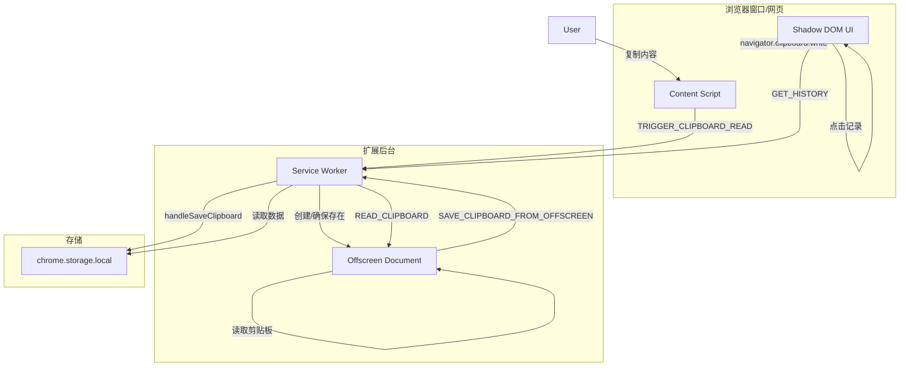

# ARCHITECT - PlugClipboard 架构设计

## 系统架构图

## 模块职责说明

1. **Content Script ([content.js](file:///e:/Hackathon/plug/content.js))**
   - 监听全局 `copy` 事件。
   - 注入并管理悬浮球和历史面板 UI。
   - 负责将历史记录重新写入剪贴板。

2. **Service Worker ([background.js](file:///e:/Hackathon/plug/background.js))**
   - 核心协调者，负责管理 Offscreen Document 的生命周期。
   - 处理数据的持久化逻辑（去重、限额、压缩后存储）。
   - 作为消息中转站。

3. **Offscreen Document ([offscreen.js](file:///e:/Hackathon/plug/offscreen.js))**
   - 运行在不可见文档中的环境，拥有完整的 DOM API。
   - 负责实际的剪贴板读取操作（通过聚焦的 `textarea`）。
   - 负责图片的压缩处理。

4. **Storage**
   - 存储结构：`{ clipboardHistory: Array<ClipboardItem> }`
   - `ClipboardItem`: `{ type, text?, image?, imageType, timestamp }`
